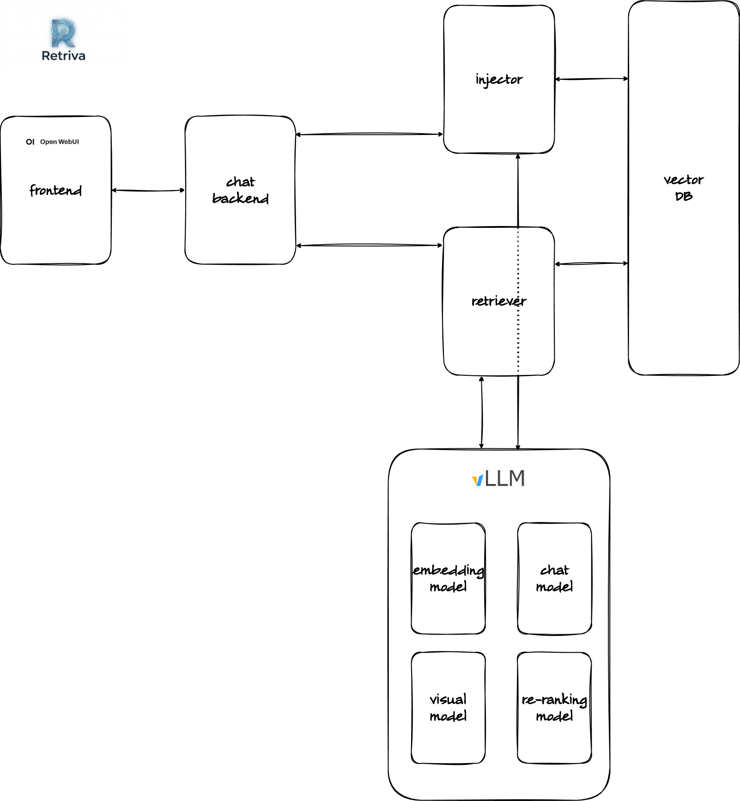

# Retriva

- [Retriva](#retriva)
  - [Introduction](#introduction)
  - [Architecture](#architecture)
  - [Licensing](#licensing)

## Introduction

Retriva is a conversational AI agent. It is built to provide users with accurate and relevant information by leveraging the power of Retrieval Augmented Generation (RAG). It is built to provide users with accurate and relevant information by leveraging the power of Retrieval Augmented Generation (RAG). It is designed for enterprise use cases where data privacy and security are of utmost importance.

For more details, please refer to [Retriva Documentation](https://github.com/am-dev-75/retriva-docs).

## Architecture

Retriva is built around a RAG (Retrieval-Augmented Generation) paradigm, currently tailored for technical documentation about embedded systems and electronics boards. Current architecture is modular and decoupled, consisting of the following key components:

- **Ingestion API (`ingestion_api/`)**: A standalone HTTP service that handles the data processing pipeline. It locally discovers filesystem-based static HTML mirrors, extracts main content, and performs section-aware text chunking.
- **Embeddings & Vector Store (`indexing/`)**: Extracted metadata and text chunks are converted into multilingual embeddings via an OpenAI-compatible endpoint. These embeddings are batched and stored in a Qdrant vector database for fast and scalable dense retrieval.
- **QA Pipeline (`qa/`)**: Drives the retrieval and generation phases. It queries Qdrant for semantic similarity, retrieves contextual chunks, and generates grounded answers based strictly on the retrieved data.
- **User Interface (`ui/`)**: A Streamlit-based frontend offering a conversational chat experience. It supports grounded answers, citations, and features an integrated debug panel to visualize the retrieval process.

The final architecture should look like .

## Licensing

This project, including all source code, agentic specifications, and documentation, is licensed under the Apache License 2.0. See the LICENSE file for details.
