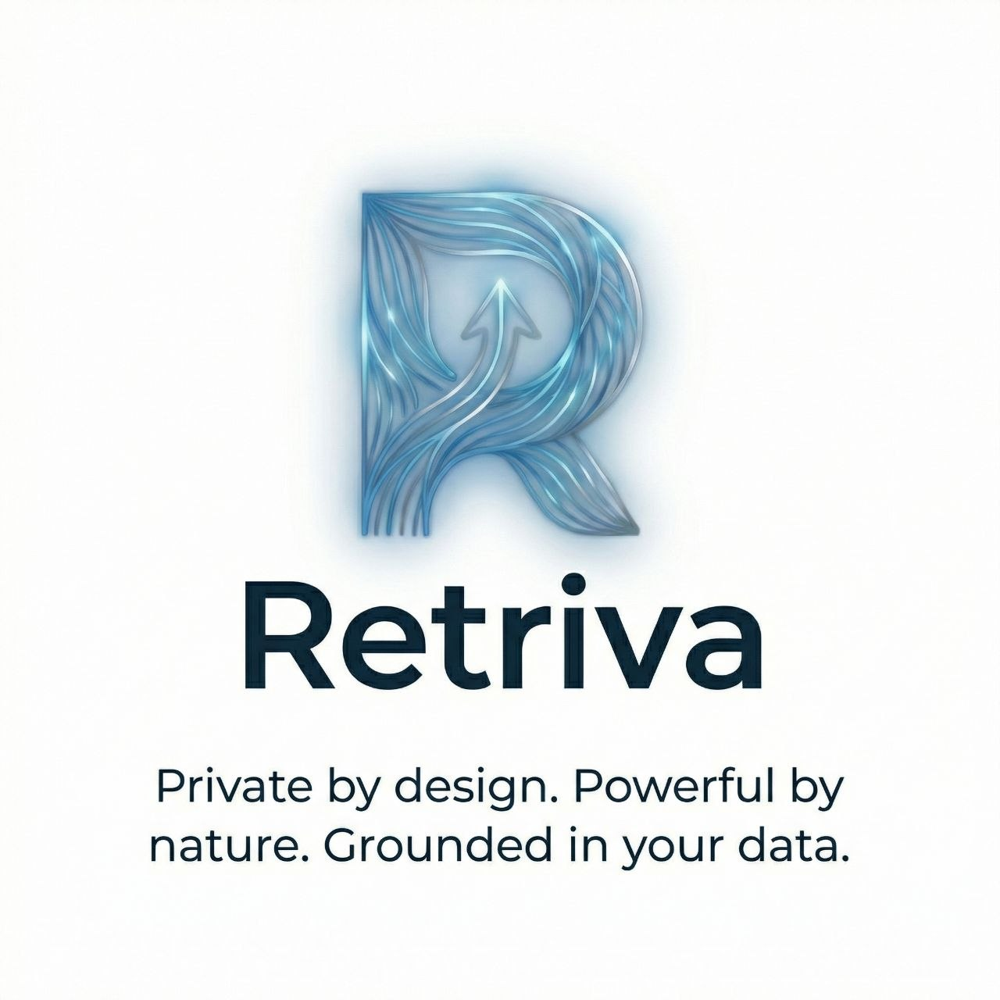
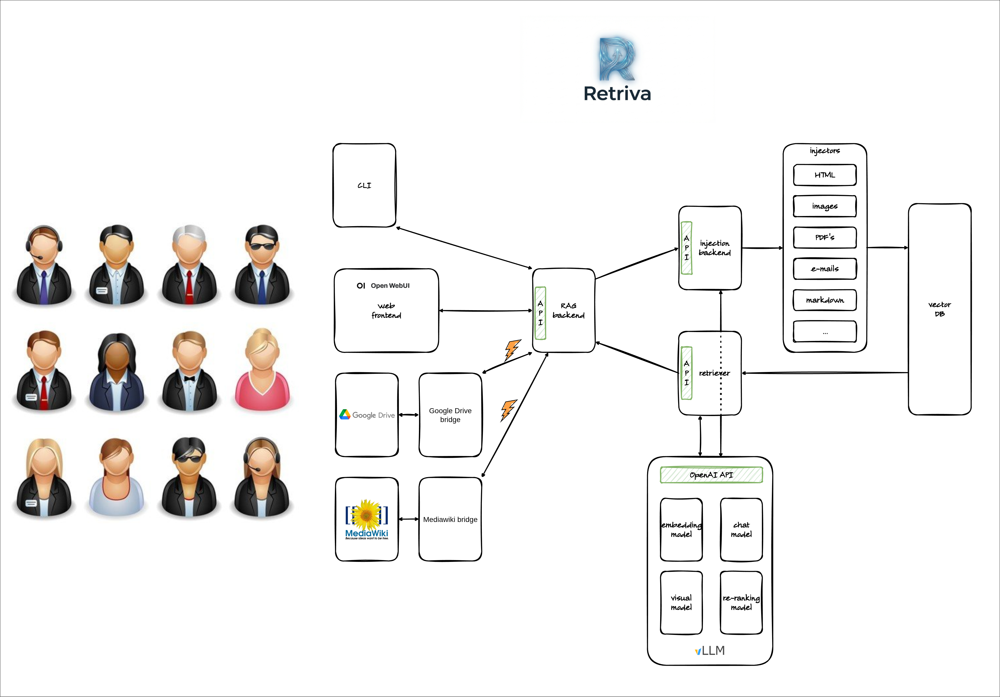
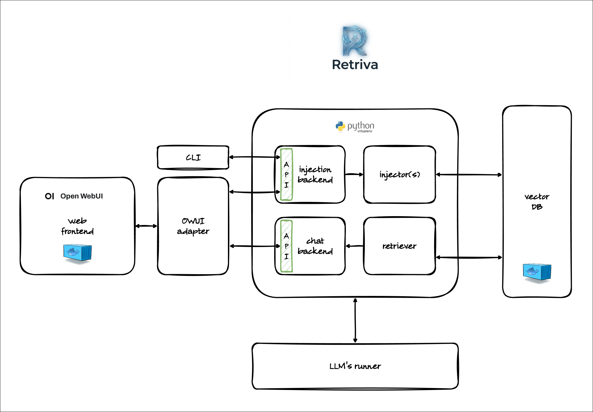

# Retriva

- [Retriva](#retriva)
  - [Introduction](#introduction)
    - [License notes](#license-notes)
  - [Architecture](#architecture)
    - [Logical architecture](#logical-architecture)
    - [Software architecture](#software-architecture)
  - [Implementation](#implementation)
  - [Quick Start](#quick-start)
    - [Use in tandem with Open WebUI (optional)](#use-in-tandem-with-open-webui-optional)
  - [Licensing](#licensing)

## Introduction

Retriva is a conversational AI agent. It is built to provide users with accurate and relevant information by leveraging the power of Retrieval Augmented Generation (RAG). It is built to provide users with accurate and relevant information by leveraging the power of Retrieval Augmented Generation (RAG). It is designed for enterprise use cases where data privacy and security are of utmost importance.

For more details abouth the birth of the project, please see also [Retriva Documentation](https://github.com/am-dev-75/retriva-docs).

### License notes

Why did I choose the Apache License 2.0? Because this license, combined with certain specific design choices, allows for the creation of Retriva extensions without being required to release them as source code. No one knows if or how the project will evolve. If anyone were ever to use it as a starting point for developing a real product, I believe that the ability to extend it permissively while still remaining connected to the main repository for core functionality is a significant advantage.

## Architecture

Retriva is built around a RAG (Retrieval-Augmented Generation) paradigm, currently tailored for technical documentation about embedded systems and electronics boards. Current architecture is modular and decoupled, consisting of the following key components:

- **Ingestion API (`ingestion_api/`)**: A standalone HTTP service that handles the data processing pipeline. It locally discovers filesystem-based static HTML mirrors, extracts main content, and performs section-aware text chunking.
- **Embeddings & Vector Store (`indexing/`)**: Extracted metadata and text chunks are converted into multilingual embeddings via an OpenAI-compatible endpoint. These embeddings are batched and stored in a Qdrant vector database for fast and scalable dense retrieval.
- **QA Pipeline (`qa/`)**: Drives the retrieval and generation phases. It queries Qdrant for semantic similarity, retrieves contextual chunks, and generates grounded answers based strictly on the retrieved data.
- **User Interface (`ui/`)**: A Streamlit-based frontend offering a conversational chat experience. It supports grounded answers, citations, and features an integrated debug panel to visualize the retrieval process.

### Logical architecture

The final architecture should look like 

### Software architecture



## Implementation

See [this page](docs/implementation.md) for the implementation details.

## Quick Start

* If not already available, [deploy a Qdrant instance](https://qdrant.tech/documentation/quickstart/).
  * This is the typical log when you start the containerized version:

```
           _                 _  
  __ _  __| |_ __ __ _ _ __ | |_  
 / _` |/ _` | '__/ _` | '_ \| __| 
| (_| | (_| | | | (_| | | | | |_  
 \__, |\__,_|_|  \__,_|_| |_|\__| 
    |_|                   

Version: 1.17.1, build: eabee371
Access web UI at http://localhost:6333/dashboard

2026-04-03T21:17:56.070752Z  INFO storage::content_manager::consensus::persistent: Loading raft state from ./storage/raft_state.json
2026-04-03T21:17:56.081084Z  INFO storage::content_manager::toc: Loading collection: retriva_chunks
2026-04-03T21:17:56.101527Z  INFO collection::shards::local_shard: Recovering shard ./storage/collections/retriva_chunks/0: 0/1 (0%)
2026-04-03T21:17:56.103581Z  INFO collection::shards::local_shard: Recovered collection retriva_chunks: 1/1 (100%)
2026-04-03T21:17:56.108149Z  INFO qdrant: Distributed mode disabled
2026-04-03T21:17:56.108463Z  INFO qdrant: Telemetry reporting enabled, id: c012b687-e64f-419e-abf8-8ada1e63a2b8
2026-04-03T21:17:56.147714Z  INFO qdrant::tonic: Qdrant gRPC listening on 6334
2026-04-03T21:17:56.147723Z  INFO qdrant::tonic: TLS disabled for gRPC API
2026-04-03T21:17:56.148679Z  INFO qdrant::actix: REST transport settings: keep_alive=5s, client_request_timeout=5s, client_disconnect_timeout=5s
2026-04-03T21:17:56.148694Z  INFO qdrant::actix: TLS disabled for REST API
2026-04-03T21:17:56.148977Z  INFO qdrant::actix: Qdrant HTTP listening on 6333
2026-04-03T21:17:56.149118Z  INFO actix_server::builder: starting 31 workers
2026-04-03T21:17:56.149514Z  INFO actix_server::server: Actix runtime found; starting in Actix runtime
2026-04-03T21:17:56.149519Z  INFO actix_server::server: starting service: "actix-web-service-0.0.0.0:6333", workers: 31, listening on: 0.0.0.0:6333
```

* After cloning this repository

  * install dependencies (use of a virtual environment is recommended):
    ```(retriva-venv) $ pip install -r requirements.txt```
  * Copy `.env` from `.env.example` and fill in the values so that Retriva can connect to the Qdrant instance and the LLM's runner(s) you intend to use.
* Start the ingestion API server:

```bash
(retriva-venv) $ PYTHONPATH=src python -m retriva.ingestion_api
```

* Build the knowledge base from *your* documents with the CLI. For instance:

```bash
(retriva-venv) $ PYTHONPATH=src python -m retriva.cli reindex --path ~/my_documents
```

For more details, run `PYTHONPATH=src python -m retriva.cli -h`.

* Start the chat application:

```bash
(retriva-venv) $ streamlit run src/retriva/ui/streamlit_app.py
```

### Use in tandem with Open WebUI (optional)

* Start the Retriva backend providing OpenAI API:

```bash
(retriva-venv) $ PYTHONPATH=src python -m retriva.openai_api
```

* Start an instance of [Open WebUI for Retriva](https://github.com/am-dev-75/open-webui_retriva).
* In Open WebUI (OWUI)
  * create admin user
  * in Admin panel->Settings, enable the flag "Enable API Keys"
  * in User'settings->Account create the API key.
  * copy this API key in the [Open WebUI/Retriva adapter](https://github.com/am-dev-75/open-webui_retriva-adapter)'s `.env` file so that the adapter che authenticate with OWUI.
* Start [Open WebUI/Retriva adapter](https://github.com/am-dev-75/open-webui_retriva-adapter).
* In OWUI, point your browser to the Open WebUI for Retriva instance and start having fun.

## Advanced features

See [this page](docs/advanced_features.md).

## Licensing

This project, including all source code, agentic specifications, and documentation, is licensed under the Apache License 2.0. See the LICENSE file for details.
